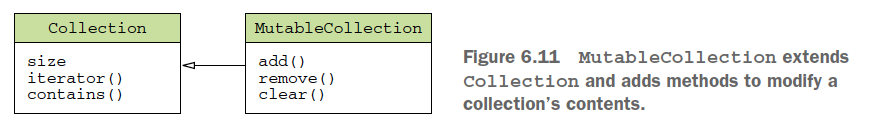
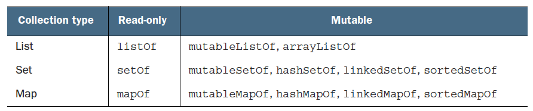
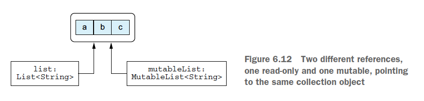

# Kotlin

var - mutable. Even though the `var` keyword allows a variable to change its value, its **type** is fixed.

val - immutable. But the object that it points to can be **mutable**.

```kotlin
val languages = arrayListOf("Java")
languages.add("Kotlin")
```

## Data Types

String/Char/Boolean/Int/Double/List/Set/Map

`==` Evaluates whether the `value` on the left is equal to the `value` on the right.

`===` Evaluates whether the two `instances` point to the `same reference`.

```kotlin
const val HERO_NAME = "Madrigal"  // compile-time constant
fun main() {
    val name = "Denis" // val - IMMUTABLE
    name = "Michael" // ERROR: val cannot be reassigned
    println("Hello, world!!! $name ${name.length}")

    /*
     var is used for variables which are mutable. Kotlin is a strongly typed language that
     The compiler will directly assume the size and type to a variable
     For example, if you assign any whole number to a variable,
     the compiler will directly assume that the variable is of type Int
    */
    var myAge = 31

    // Integer types: Byte (8 bit), Short (16 bit), Int (32 bit), Long (64 bit)
    val myByte: Byte = 127          // 2^7 - 1
    val myShort: Short = 32767      // 2^15 - 1
    val myInt: Int = 2_147_483_647  // 2^31 - 1
    val myLong: Long = 9_223_372_036_854_775_807    // 2^63 - 1

    // Floating Point number Types: Float (32 bit), Double (64 bit)
    val myFloat: Float = 13.37F
    val myDouble: Double = 3.14159265358979323846

    // Boolean
    var isSunny: Boolean = true

    // Char
    val letterChar = 'A'
    val digitChar = '1'

    // String
    val myStr = "Hello World"
    var firCharInStr = myStr[0]
    var lastCharInStr = myStr[myStr.length - 1]
}
```

## if/when/while/for

```kotlin

// Conditional Expression
val result: String = if (isA) "a" else "b"

// when
var season = 3
when(season) {
    1 -> println("Spring")
    2 -> println("Summer")
    3 -> {
        println("Fall")
        println("Autumn")
    }
    4 -> println("Winter")
    else -> println("invalid")
}

when(age) {
    !in 0..20  -> print("now you may drink in the US")
    in 18..20  -> print("now you may vote")
    16,17 -> print("you now may drive")
    else -> print("you're too young")
}

var x: Any = 13.37f
var x: Any = "string"
when(x) {
    is Int -> println("$x is an Int")
    !is Double -> println("$x is not Double")
    is String -> println("$x is a String")
    else -> println("$x is none of the above")
}
// $x is not Double
// $x is not Double

val x : Any = 13.37 // Double
val result =  when(x) {
    is Int -> "is an Int"
    !is Double -> "is not Double"
    is String -> "is a String"
    else -> "is none of the above"
}
print("$result") // 13.37 is none of the above

// Ranges
for(num in 1..10) {...} // 1 2 3 4 5 6 7 8 9 10
for(i in 1 until 10) { // Same as - for(i in 1.until(10))
    print("$i ")
}
// 1 2 3 4 5 6 7 8 9

for(i in 10 downTo 1) {  // Same as - for(i in 10.downTo(1))
    print("$i ")
}
for(i in 10 downTo 1 step 2) { // Same as - for(i in 10.downTo(1).step(2))
    print("$i ") // 10 8 6 4 2
}

// in to check collection and range membership
fun isLetter(c: Char) = c in 'a'..'z' || c in 'A'..'Z'
fun isNotDigit(c: Char) = c !in '0'..'9'
```

## function

```kotlin
// default argument
fun addUp(a: Int, b: Int = 0): Int {
    return a + b
}
addUp(a = 2, b = 3)

private fun quest(playerLevel: Int): String {
    return when (playerLevel) {
        1 -> "1"
        else -> "else"
    }
}
// single expression function
private fun quest(playerLevel: Int) = when (playerLevel) {
    1 -> "1"
    else -> "else"
}
```

`Unit` function - functions w/o return type, Kotlin automatically used the `Unit` return type.

```kotlin
fun max(a: Int, b: Int): Int {
    return if (a > b) a else b
}
fun max(a: Int, b: Int): Int = if (a > b) a else b

fun <T> joinToString(
    collection: Collection<T>,
    sseparator: String = ", ",
    prefix: String = "",
    postfix: String = ""
): String {
    val result = StringBuilder(prefix)
    for ((index, element) in collection.withIndex()) {
        if (index > 0) result.append(separator)
        result.append(element)
    }
    result.append(postfix)
    return result.toString()
}
joinToString(list, ", ", "", "")  // 1, 2, 3
joinToString(list)  // 1, 2, 3
joinToString(list, "; ")  // 1; 2; 3
// named arguments, you can omit some arguments from the middle of the list
// and specify only the ones you need, in any order you want
joinToString(list, suffix = ";", prefix = "# ")  // # 1, 2, 3;
```

### Extension function

```kotlin
// declare an extension function on Collection<T>
fun <T> Collection<T>.joinToString(
    separator: String = ", ",
    prefix: String = "",
    postfix: String = "")
: String {
    val result = StringBuilder(prefix)
    // `this` refers to the receiver object: a collection of T
    for ((index, element) in this.withIndex())
        if (index > 0) result.append(separator)
        result.append(element)
    }
    result.append(postfix)
    return result.toString()
}
val list = listOf(1, 2, 3)
list.joinToString(separator = "; ", prefix = "(", postfix = ")") // (1; 2; 3)

val list = arrayListOf(1, 2, 3)
list.joinToString(" ")  // 1 2 3
```

## Nullable

`nullables` declare whether a variable can hold a `null` value or not.
The compiler can detect possible `NullPointerException` errors at _compile_ time

```kotlin
var name: String = "Denis"
name = null // Compilation Error!
val len = name.length
val lower = name.toLowerCase()

var nullableName: String? = "Denis"
nullableName = null // Works
val len2 = nullableName.length // Compilation Error
val lower2 = nullableName.toLowerCase()  // Compilation Error

// null check
if (nullableName != null) {
    println("Hello, ${nullableName.toLowerCase()}.")
} else {
    println("Hello, Guest")
}

// 'safe call' operator ?. combine a null-check and a method call in a single expression.
nullableName?.length
nullableName?.toLowerCase()

// This is the same as:
if (nullableName != null)
    nullableName.toLowerCase()
else
    null

// use methods on a nullable variable
val nullableName3: String? = null
println(nullableName3?.toLowerCase()) // null
println(nullableName3?.length) // null

// chain safe call
val wifesAge: String? = user?.wife?.age

// 'safe call' operator with 'let'
val nullableName4: String? = null
nullableName4?.let { println(it.toLowerCase()) }  // null
nullableName4?.let { println(it.length) }  // null

// use the elvis operator ?: to enter a default value
val name = nullableName4 ?: "Guest"
val wifesAge: Int = user?.wife?.age ?: 0

// The !! operator converts a nullable type to a non-null type,
// and throws a NullPointerException if the nullable type holds a null value.
// This is risky, only use it if 100% certain that there will be a value in the variable.
val nullableName5: String? = null
nullableName5!!.toLowerCase() // Results in NullPointerException
```

## OOP

### enum class

```kotlin
enum class Color {
    RED, ORANGE, YELLOW, GREEN, BLUE, INDIGO, VOILET
}

enum class Color(val r: Int, val g: Int, val b: Int) {
    RED(255, 0, 0),
    ORANGE(255, 165, 0),
    YELLOW(255, 255, 0),
    GREEN(0, 255, 0),
    BLUE(0, 0, 255),
    INDIGO(75, 0, 130),
    VIOLET(238, 130, 238);

    fun rgb() = (r * 256 + g) * 256 + b
}
println(Color.BLUE.rgb()) // 255

fun getWarmth(color: Color) = when(color) {
    Color.RED, Color.ORANGE, Color.YELLOW -> "warm"
    Color.GREEN -> "neutral"
    Color.BLUE, Color.INDIGO, Color.VIOLET -> "cold"
}
println(getWarmth(Color.ORANGE)) // warm

fun mix(c1: Color, c2: Color) = when (setOf(c1, c2)) {
    setOf(RED, YELLOW) -> ORANGE
    setOf(YELLOW, BLUE) -> GREEN
    setOf(BLUE, VIOLET) -> INDIGO
    else -> throw Exception("Dirty color")
}
println(mix(BLUE, YELLOW)) // GREEN
```

### Class

```kotlin

// primary constructor
class Person(var firstName: String = "John", var lastName: String = "Doe")
// The same but detailed
class Person constructor(_firstName: String = "John", _lastName: String = "Doe") {
    // properties of the class
    var firstName: String
    var lastName: String

    // initializer block
    init {
        this.firstName = _firstName
        this.lastName = _lastName
        println("Initialized a new Person object with firstName = $firstName and lastName = $lastName")
    }
}

// alternative:
class Person(_firstName: String = "John", _lastName: String = "Doe") {
    var firstName: String = _firstName
    var lastName: String = _lastName

    init {
        println("Initialized a new Person object with firstName = $firstName and lastName = $lastName")
    }
}

// alternative:
// parameters of the constructor
class Person constructor(var firstName: String = "John", var lastName: String = "Doe") {
    init {
        println("Initialized a new Person object with firstName = $firstName and lastName = $lastName")
    }
}

var mark = Person("Mark", "Zhang")  // initialized a new Person object with firstName = Mark and lastName = Zhang
var john = Person()  // initialized a new Person object with firstName = John and lastName = Doe

class Person(var firstName: String, var lastName: String) {
    var age: Int? = null
    var hobby: String = "Watch Netflix"
    var myFirstName = firstName

    // secondary constructor
    constructor(firstName: String, lastName: String, age: Int): this(firstName, lastName)  {
        this.age = if (age > 0) age else throw IllegalArgumentException("Age must be greater than zero")
    }

    fun stateHobby(){
        println("$myFirstName\'s Hobby is: $hobby" )
    }
}
// use primary constructor (age will be null)
val person1 = Person("Denis", "Panjuta")

// use secondary constructor
val person2 = Person("Elon", "Musk", 48)

// class with multiple overloads:
class Person(var firstName: String, var lastName: String) {
    var age: Int? = null
    var eyeColor: String? = null

    // Secondary Constructor
    constructor(firstName: String, lastName: String, age: Int): this(firstName, lastName)  {
        this.age = if(age > 0) age else throw IllegalArgumentException("Age must be greater than zero")
    }

    // Secondary Constructor
    constructor(firstName: String, lastName: String, age: Int, eyeColor: String): this(firstName, lastName, age)  {
        this.eyeColor = eyeColor
    }
}

class Car() {
    lateinit var owner: String

    val brand: String = "BMW"
        // custom getter
        get() {
            return  field.lowercase()
        }

    var maxSpeed: Int = 250
        get() = field
        set(value) {
            field = if (value > 0) value else throw IllegalArgumentException("maxSpeed cannot be less than 0")
        }

    var model: String = "M5"
        // accessor visibility
        private set // cannot set it in other class

    init {
        // created car object will be with model "M3" by default, here it calls to set model
        this.model = "M3"
        this.owner = "Owner"
    }
}
```

### Getter/Setter

```kotlin
class User(val name: String) {
    var address: String = "unspecified"
        set(value: String) {
            println("""Address was changed for $name:
            "$field" -> "$value".""".trimIndent())
            field = value
        }
}
val user = User("Alice")
user.address = "Elsenheimerstrasse 47, 80687 Muenchen"
// Address was changed for Alice:
// "unspecified" -> "Elsenheimerstrasse 47, 80687 Muenchen".
```

### Data Class

In `data class`, necessary methods are automatically generated for you. e.g. toString(), equals(), and hashCode(). Properties that aren't declared in the `primary constructor` don't take part in the `equality` checks and `hash code` calculation.

```kotlin
data class User(val id: Long, var name: String)
val user1 = User(1, "Ziyi")
val (id, name) = user1  // de-constructor

user1.id = 2            // cannot change because of val
user1.name = "Mark"     // works because of var
val user2 = User(1, "Mark")
user1.equals(user2)     // true
val updatedUser = user1.copy(name="updated name")
print(user1)            // (id=1, name=Mark)
print(updatedUser)      // (id=1, name=updated name)
```

## Inheritance

`open` - can be inherited by others
`sealed` - cannot be inherited

```kotlin
open class Vehicle {}
open class Car: Vehicle() {}
class ElectricCar: Car() {}

open class Car(val name: String, val brand: String) {
    open var range: Double = 0.0
    // final by default
    fun extendRange(amount: Double) {
        if (amount > 0)
            range += amount
    }
    open fun drive(distance: Double) {
        println("Drove for $distance KM")
    }
}

class EletricCar(name: String, brand: String): Car(name, brand) {...}
audiA3.drive(200.0) // Drove for 200 KM
teslaS.drive(200.0) // Drove for 200 KM
teslaS.extendRange(200)

class EletricCar(name: String, brand: String, batteryLife: Double): Car(name, brand) {
    // to override in a child class, has to be OPEN in the parent class
    override var range = batteryLife * 6
    // custom property for the child class
    var chargerType = "type1"

    // inherit from Car
    override fun drive(distance: Double) {
        println("Drove for $distance KM on electricity")
    }
    // method for ElectricCar class only - no parameter
    fun drive() {
        println("Drove for $range KM on electricity")
    }
}

var audiA3 = Car("A3", "Audi")
var teslaS = ElectricCar("ModelS", "Tesla", 85.0)

// implement properties declared in interface
interface User {
    val nickname: String
}
class PrivateUser(override val nickname: String): User
class SubscribingUser(val email: String): User {
    override val nickname: String
        get() = email.substringBefore("@")
}
class FacebookUser(val accountId: Int): User {
    override val nickname = getFacebookName(accountId)
}
```

### Sealed class

一个有特定数量子类的类，看上去和枚举有点类似，所不同的是，在枚举中，我们每个类型只有一个对象(实例)；而在密封类中，同一个类可以拥有几个对象。

```kotlin
sealed class Expr {
    class Num(val value: Int): Expr()
    class Sum(val left: Expr, val right: Expr): Expr()
}
// The “when” expression covers all possible cases, so no “else” branch is needed
fun eval(e: Expr): Int = when(e) {
    is Expr.Num -> e.value
    is Expr.Sum -> eval(e.right) + eval(e.left)
}
```

## Interface

```kotlin
interface Drivable {
    val maxSpeed: Double
    // may have implementation or not
    fun drive(): String
    fun brake() {
        println("The drivable is braking")
    }
}

open class Car(override val maxSpeed: Double,
                val name: String,
                val brand: String
): Drivable {
    open var range: Double = 0.0
    fun extendRange(amount: Double) {
        if (amount > 0)
            range += amount
    }
    // this override function is required - public by default
    override fun drive(): String {
        return "driving the interface drive"
    }
    open fun drive(distance: Double) {
        println("Drove for $distance KM")
    }
}

class EletricCar(maxSpeed: Double,
                    name: String,
                    brand: String,
                    batteryLife: Double
): Car(maxSpeed, name, brand) {
    // override range in the Car class
    override var range = batteryLife * 6
    var chargerType = "type1"

    // inherit from Car
    override fun drive(distance: Double) {
        println("Drove for $distance KM on electricity")
    }
    override fun drive(): String {
        return "Drove for $range KM on electricity"
    }
    // override Drivable interface
    override fun brake() {
        super.brake()
    }
}
```

## Abstract Class

A `class` can impletement multiple `interfaces` but only one `class`.
`Abstract class` can have constructors and properties initilized

```kotlin
// cannot instantiate an abstract class, but you can inherit from it
abstract class Mammal(private val name: String, // these 3 parameters are concrete (non abstract) properties
                      private val origin: String,
                      private val weight: Double) {
    // abstract property must be overridden by subclass
    abstract var maxSpeed: Double

    // abstract methods must be implemented by subclass
    abstract fun run()
    abstract fun breath()

    // concrete (non abstract) method
    fun displayDetails() {
        print("Name: $name, Origin: $origin, Weight: $weight, maxSpeed: $maxSpeed")
    }
}

class Human(name: String,
            origin: String,
            weight: Double,
            override var maxSpeed: Double): Mammal(name, origin, weight) {
    override fun run() {
        print("run() implementation")
    }
    override fun breath() {
        print("breath() implementation")
    }
}
```

## Type and Casting

```kotlin
val stringList: List<String> = listOf("a", "b", "c")
val mixedTypeList: List<Any> = listOf("a", 31, b, "70.5")

for (value in mixedTypeList) {
    if (value is Int) {}
    else if (value is Double) {}
    else if (value is String) {}
    else {}

    // alternative
    when (value) {
        is Int -> println()
        is Double -> println()
        is String -> println()
        else -> println()
    }
}

// Casting
val obj1: Any = "string"
obj1 is String // true

// Explicit unsafe casting
val obj2: Any = 15
val str2: String = obj2 as String
str2.length    // ClassCastException

// Explicit safe casting
val obj3: Any = 1337
val str3: String? = obj3 as? String
str3 // null
```

## Collections

Read-only and mutable collections



Read-only collections can be mutable.


### Array

```kotlin
// type - IntArray/DoubleArray/BooleanArray...
val numbers: IntArray = intArrayOf(1, 2, 3, 4, 5)
val numbers = intArrayOf(1, 2, 3, 4, 5)
val numbers = arrayOf(1, 2, 3, 4, 5)

data class Fruit(val name: String, val price: Double)
val fruits = arrayOf(Fruit("Apple", 2.5), Fruit("Grape", 3.5))
print(fruits.contentToString())

for (index in fruits.indices) {
    println("${fruits[index].name} is in index $index")
}

val squares = IntArray(5) { i -> (i+1) * (i+1) } // 1, 4, 9, 16, 25
```

### List

```kotlin
val months = listOf("Jan", "Feb", "March")
println(months[1])
val additionalMonths = months.toMutableList()
additionalMonths.add("Apr")     // [Jan, Feb, March, Apr]

val days = mutableListOf<String>("Mon", "Tue", "Wed")
days.add("Thu")
println(days)       // [Mon, Tue, Wed, Thu]
days[2] = "Sunday"  // [Mon, Tue, Sunday, Thu]
val removeList = mutableListOf<String>("Mon", "Wed")
days.removeAll(removeList)  // [Tue, Sunday, Thu]

val anyTypes = listOf(1, 2, 3, true, "string")

fun readNumbers(reader: BufferedReader): List<Int?> {
    val result = ArrayList<Int?>() // create a list of nullable Int values
    for (line in reader.lineSequence()) {
        try {
            val number = line.toInt()
            result.add(number)
        } catch(e: NumberFormatException) {
            result.add(null)
        }
    }
    return result
}
```

### Set/Map

```kotlin
val fruits = setOf("Orange", "Apple", "Apple", "Mango")
println(fruits.size)            // 3
println(fruits.toSortedSet())   // [Apple, Mango, Orange]

val newFruits = fruits.toMutableSet()
newFruits.add("Melon")
println(newFruits.toSortedSet())    // [Apple, Mango, Melon, Orange]

val daysWeek = mapOf(1 to "Monday", 2 to "Tuesday")
println(daysWeek[2])    // Tuesday
for (key in daysWeek.keys) {
    println("$key is to ${daysWeek[key]}")
}
val newDaysWeek = daysWeek.toMutableMap()
newDaysWeek[4] = "Thursday"
println(newDaysWeek.toSortedMap())  // {1=Monday, 2=Tuesday, 4=Thursday}
```

## Lambda function

```kotlin
// normal function
fun addNumber (a: Int, b: Int) {
    val answer = a + b
    print(answer)
}

// lambda
val sum: (Int, Int) -> Int = { a: Int, b: Int -> a + b }
// or
val sum = { a: Int, b: Int -> println(a + b) }
sum(10, 5)

val people = listOf(Person("Alice", 29), Person("Bob", 31))
people.maxBy { it.age }
people.maxBy({ p: Person -> p.age })  // lambda verbose

// using function parameters in a lambda
fun printProblemCounts(responses: Collection<String>) {
    var clientErrors = 0
    var serverErrors = 0
    responses.forEach {
        if (it.startsWith("4")) {
            clientErrors++
        } else if (it.startsWith("5")) {
            serverErrors++
        }
    }
    println("$clientErrors client errors, $serverErrors server errors")
}
val responses = listOf("200 OK", "418 I'm a teapot", "500 Internal Server Error")
printProblemCounts(responses) // 1 client errors, 1 server errors
```

```java
// passing lambda as parameter to a Java method
void postponeComputation(int delay, Runnable computation);
```

```kotlin
postponeComputation(1000) { println(42) }
// or pass an object expression as an implementation of a functional interface
postponeComputation(1000, object: Runnable {
    override fun run() {
        println(42)
    }
})
```

`with` function

The `with` function takes 2 arguments: `stringBuilder` and a `lambda`. It converts the first argument into a `receiver` of the lambda, which is passed as the second argument.

`this` refers to `stringBuilder`, which is passed to `with` as the first
argument. You can access methods on stringBuilder via explicit `this` references,
as in `this.append(letter);` or directly, as in `append("Done")`.

```kotlin
fun alphabet(): String {
    val result = StringBuilder()
    for (letter in 'A'..'Z') {
        result.append(letter)
    }
    result.append("Done")
    return result.toString()
}
println(alphabet()) // ABCDEFGHIJKLMNOPQRSTUVWXYZ Done

fun alphabet(): String {
    val stringBuilder = StringBuilder()
    return with(stringBuilder) {
        for (letter in 'A'..'Z') {
            this.append(letter)
        }
        append("Done")
        this.toString()
    }
}
// more refactoring
fun alphabet() = with(StringBuilder()) {
    for (letter in 'A'..'Z') {
        append(letter)
    }
    append("Done")
    toString()
}
```

`apply` function
The `apply` function works almost exactly the same as `with`; the only difference is that `apply` always returns the object passed to it as an argument (in other words, the receiver object)

```kotlin
fun alphabet() = StringBuilder().apply {
    for (letter in 'A'..'Z') {
        append(letter)
    }
    append("Done")
}.toString()

// The apply function allows you to use the compact expression body style for the function.
// You create a new TextView instance and immediately pass it to apply. In the
// lambda passed to apply, the TextView instance becomes the receiver, so you can call
// methods and set properties on it. After the lambda is executed, apply returns that
// instance, which is already initialized; it becomes the result of the
// createViewWithCustomAttributes function.
fun createViewWithCustomAttributes(context: Context) =
    TextView(context).apply {
        text = "Sample Text"
        textSize = 20.0
        setPadding(10, 0, 0, 0)
    }
```

## Access Modifier

- `final` - cannot be overriden, default for class members
- `open` - can be overriden, should be specified explicitly
- `abstract` - MUST be overriden, can only be used in `abstract` classes, `abstract members` cannot have an implementation.
- `override` - overrides a member in a superclass or interface. Overriden member is `open` by default if not marked `final`

## Visibility Modifier

- `public`(default) - element is accessible from everywhere in the project
- `private` - element is accessible only _within the block_ in which properties, fields are declared
- `protected` - modifier with a class or an interface allows visibility to its class or subclass only
- `internal` - makes the field visible only inside the module in which it is implemented
- All classes are `final` by default, so they can't be inherited - use `open` key word

```kotlin
open class Base {
    var a = 1                   // public by default
    private var b = 2           // private to Base class
    protected open val c = 3    // visible to the Base and the Derived class
    internal val d = 4          // visible in the same module
    protected fun e() {}        // visible to the Base and the Derived class
}
class Derived: Base() {
    // a, c, d and e() of the Base class are visible
    override val c = 9          // here, c is still protected
}

fun main(args: Array<String>) {
    val base = Base()
    // base.a and base.d are visible
    // base.b, base.c and base.e() are not visible
    val derived = Derived()
    // only derived.a and derived.d are visible
}
```

## Nested class Inner class

`Nested class` - created inside another class. Is by default `static`

`Nested class` - **cannot** access the data members of outer classes

`Inner class` - created inside another class with keyword `inner`. It is able to access members of its outer class even it is private. `Inner class` keeps a reference to an object of its outer class.

```kotlin
// Nested class
class OuterClass {
    private var name: String = "x"
    class NestedClass {
        var description: String = "xx"
        private var id: Int = 101
        fun foo() {
            // CANNOT access the outer class member `name`
        }
    }
}

fun main(args: Array<String>) {
    OuterClass.NestedClass().description    // can access member property
    var obj = OuterClass.NestedClass()
    obj.foo()                               // can access member function
}

// Inner class
class OuterClass {
    private var name: String = "x"
    inner class InnerClass {
        var description: String = "xx"
        private var id: Int = 101
        fun foo() {
            // can access the `private` property name of the outer class
            println("name is ${name}")
        }
    }
}

fun main(args: Array<String>) {
    OuterClass().InnerClass().description    // can access member property
    var obj = OuterClass().InnerClass()
    obj.foo()                               // can access member function
}
```

## Cast

Unsafe cast `as`
Safe cast `as?`

```kotlin
val obj: Any? = "nullable string"
val str: String? = obj as String?  // works

val location: Any = "Kotlin"
val safeString: String? = location as? String  // Kotlin
val safeInt: Int? = location as? Int  // null
```

## try catch

#### Unchecked Exception

- exception that is thrown due to mistakes in our code
- `Unchecked Exception` extends the `RuntimeException` class, is checked at run time
- e.g. ArithmeticException, ArrayIndexOutOfBoundException, SecurityException, NulPointerException

#### Checked Exception

- `Checked Exception` extends the `Throwable` class
- checked at compile time
- e.g. IOException, SQLException

```kotlin
fun getNumber(str: String): Int {
    return try {
        Integer.parseInt(str)
    } catch (e: ArithmeticException) {
        0
    }
}
val str = getNumber("10.5")
println(str)    // 0

fun validate(age: Int) {
    if (age < 18) {
        throw ArithmeticException("under age")
    } else {
        print()
    }
}
validate(15)
println("code after validation check")
// Exception in thread "main: under age."
```

## dp sp

```kotlin
// LinearLayout
android:orientation="vertical"
android:layout_weight="1"
android:onClick="onPress"
(view as Button).text
android:padding="10dp"
android:gravity="right|bottom|center_vertical"

android:screenOrientation="portrait"
android:theme="@style/NoActionBarTheme"
// resize when soft keyboard displays
android:windowSoftInputMode="adjustResize"
```

## Room Database

### 3 components of Room Database

- Entity
- DAO
- Database

## object Keyword

The `object` keyword defines a class and creates an instance of that class at the same time.

1. object declaration - combine `class` declaration and a declaration of `a single instance` of that class

```kotlin
object Payroll {
    val allEmployees = arrayListOf<Person>()
    fun calculateSalary() {
        for (person in allEmployees) {
            ...
        }
    }
}
Payroll.allEmployees.add(Person(...))
Payroll.calculateSalary()
```

`object declaration` can also inherit from `classes` and `interfaces`

```kotlin
// inherit from interface
object CaseInsensitiveFileComparator: Comparator<File> {
    override fun compare(file1: File, file2: File): Int {
        return file1.path.compareTo(file2.path, ignoreCase = True)
    }
}
println(CaseInsensitiveFileComparator.compare(File("/User"), File("/user"))) // 0

val files = listOf(File("/Z"), File("/a"))
println(files.sortedWith(CaseInsensitiveFileComparator)) // [/a, /Z]
```

Nested object

```kotlin
data class Person(val name: String) {
    object NameComparator : Comparator<Person> {
        override fun compare(p1: Person, p2: Person): Int = p1.name.compareTo(p2.name)
    }
}
val persons = listOf(Person("Bob"), Person("Alice"))
println(persons.sortedWith(Person.NameComparator)) // [Person(name=Alice), Person(name=Bob)]
```

2. Companion object - `static` property/function in Kotlin

```kotlin
class A {
    companion object {
        fun bar() {...}
    }
}
A.bar()

class User private constructor(val nickname: String) {  // private primary constructor
    companion object {
        fun newSubscribingUser(email: String) = User(email.substringBefore("@"))
        fun newFacebookUser(accountId: Int) = User(getFacebookName(accountId))
    }
}
val subscribingUser = User.newSubscribingUser("bob@gmail.com")
val facebookUser = User.newFacebookUser(4)
```
