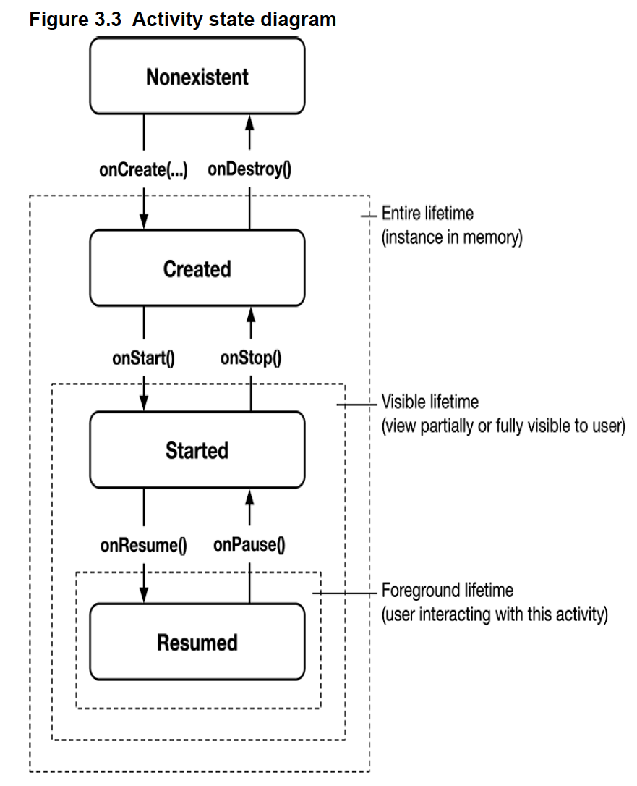

### px/dp/sp

px

- One pixel corresponds to one onscreen pixel, regardless of the display density.
- Because pixels do not scale appropriately with device display density, their use is not recommended.

dp

- Short for `density-independent pixel`.
- Typically use this for margins, padding, or anything else for which you would otherwise specify size with a pixel value. One **dp** is always `1/160` of an inch on a device’s
  screen.
- You get the same size regardless of screen density - when your display is a higher density, density-independent pixels will fill a larger number of screen pixels.

sp

- Short for `scale-independent pixel`.
- `Scale-independent pixels` are `density-independent pixels` that also take into account the user’s **font size preference**. You will almost always use `sp` to set **display text size**.

### Activity Lifecycle



- onCreate(Bundle?)
  - inflate views and put them onscreen(in the call to `setContentView()`)
  - get references to inflated views(`view binding` or `findViewById()`)
  - set `listeners` on views to handle user interaction
  - connect to external model data

#### Minimum SDK version

- The `minSdk` value is a hard floor below which the OS should refuse to install the app.

#### Target SDK version

1.  The `targetSdk` value tells Android which API level your app is designed to run on.
1.  Mostly it will be set to the latest Android release.
1.  If your app will have issues with a new release of Android, you can modify your app to work with the new behavior and update the target SDK – or you can leave the codebase and target SDK as they were
1.  Not increasing the target SDK means that your app will continue running with the appearance and behavior of the targeted version on which it worked well

#### Compile SDK version

1. Android’s features are exposed through the classes and functions in the SDK. The compile SDK version specifies which version to use when building your code.
1. When Android Studio is looking to find the classes and functions you refer to in your imports, the compile SDK version determines which SDK version it checks against
1. The best choice for a compile SDK version is the latest API level available

```kotlin
@RequiresApi(Build.VERSION_CODES.S)
private fun blurCheatButton() {
    val effect = RenderEffect.createBlurEffect(
        10.0f,
        10.0f,
        Shader.TileMode.CLAMP
    )
    binding.cheatButton.setRenderEffect(effect)
}
...
if (Build.VERSION.SDK_INT >= Build.VERSION_CODES.S) {
    blurCheatButton()
}
// blurring code will only be called when the app is running on a device with API level 31 or higher. You have made your code safe for API level 24(minSdk)
```
