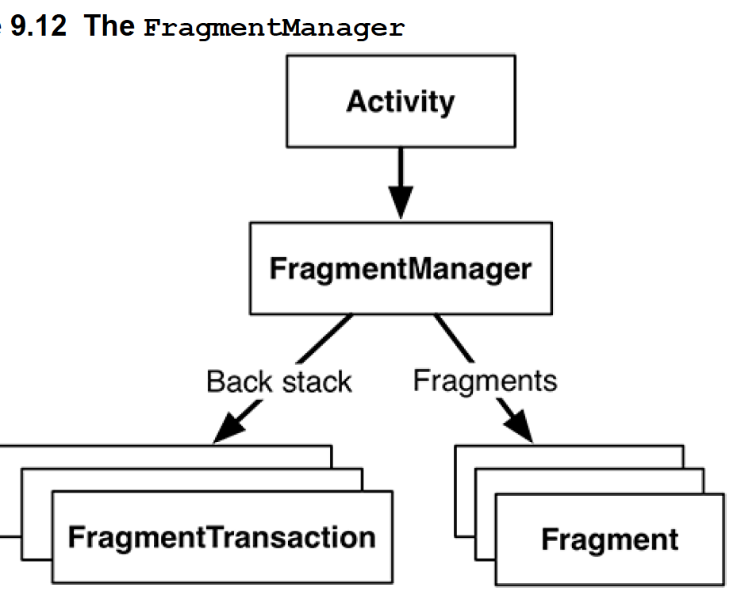
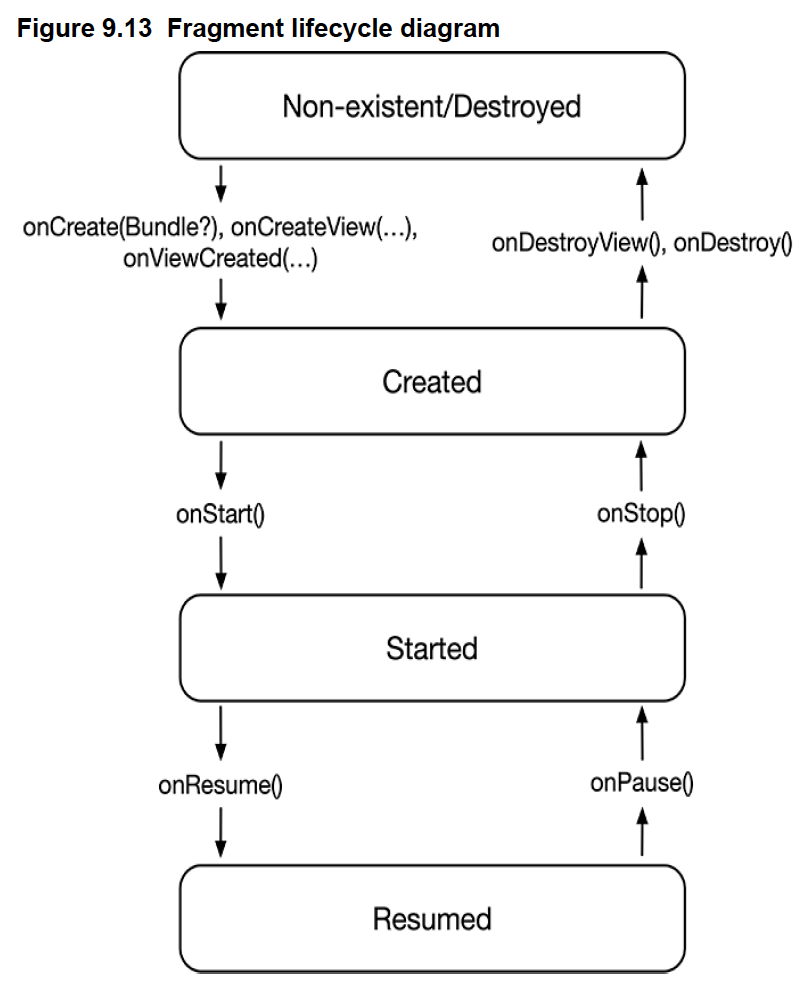
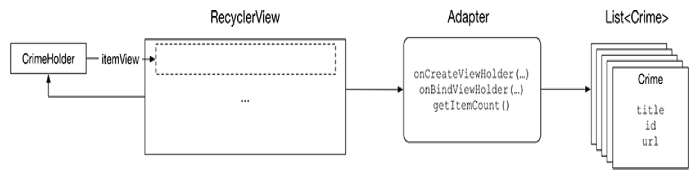
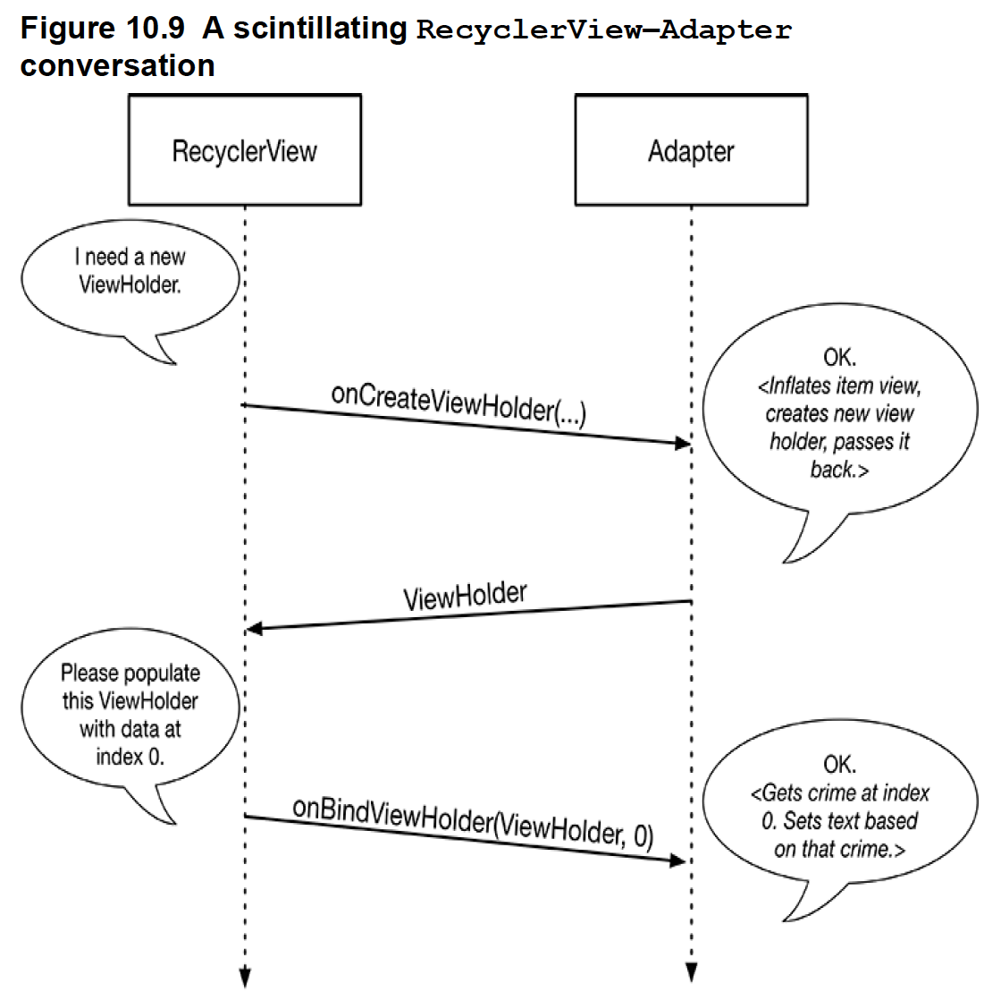
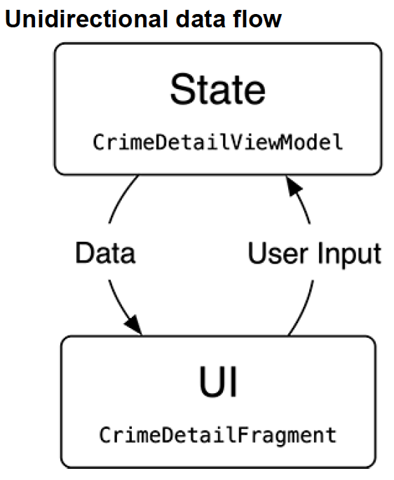

### px/dp/sp

#### px

- One `pixel` corresponds to one onscreen pixel, regardless of the display density.
- Because pixels do not scale appropriately with device display density, their use is not recommended.

#### dp

- Short for `density-independent pixel`.
- Typically use this for **margins**, **padding**, or anything else for which you would otherwise specify size with a pixel value. One **dp** is always `1/160` of an inch on a device’s screen.
- You get the same size regardless of screen density - when your display is a higher density, density-independent pixels will fill a larger number of screen pixels.

#### sp

- Short for `scale-independent pixel`.
- `Scale-independent pixels` are `density-independent pixels` that also take into account the user’s **font size preference**. You will almost always use `sp` to set **display text size**.

### Activity Lifecycle


- Navigate to Home screen

  - onPause()
  - onStop()

- Select the app in overview screen

  - onStart()
  - onResume()

- Finish an activity

  - onPause()
  - onStop()
  - onDestroy()

- Rotate the device
  - onPause()
  - onStop()
  - onDestroy()
  - onCreate()
  - onStart()
  - onResume()

In `onCreate(Bundle?)`, it usually does:

- inflate views and put them onscreen(in the call to `setContentView()`)
- get references to inflated views(`view binding` or `findViewById()`)
- set `listeners` on views to handle user interaction
- connect to external model data

### Device Configuration Changes and the Activity Lifecycle

The `device configuration` is a set of characteristics that describe the current state of an individual device, e.g. screen orientation, screen density, screen size, keyboard type, dock mode, language.

```kotlin
private val quizViewModel: QuizViewModel by viewModels()
```

The `by` keyword indicates that a property is implemented using a `property delegate`. In Kotlin, a property delegate is a way to delegate the functionality of a property to an external unit of code. A very common property delegate in Kotlin is `lazy`. The `lazy` property delegate allows developers to save resources by waiting to initialize the property only when it is accessed.

Under the hood, the `viewModels()` property delegate handles many things for you. When the activity queries for a `QuizViewModel` for the first time, `viewModels()` creates and returns a new `QuizViewModel` instance. When the activity queries for the `QuizViewModel` after a configuration change, the instance that was first created is returned. When the activity is finished (such as when the user closes the app from the overview screen), the `ViewModel–Activity` pair is removed from memory.

### ViewModel

When you associate a `ViewModel` instance with an activity’s lifecycle, the `ViewModel` is said to be **scoped** to that activity’s lifecycle. This means the `ViewModel` will remain in memory, regardless of the activity’s state, until the activity is finished.


### View Binding

A feature of the **build process** that generates that boilerplate code for you and allows you to safely and easily interact with your UI elements.

app/build.gradle

```
android {
    ...
    buildFeatures {
        viewBinding true
    }
}
```

```kotlin
private lateinit var binding: ActivityMainBinding
binding = ActivityMainBinding.inflate(layoutInflater)
setContentView(binding.root)
```

### Debugging

- Stack trace logging:

```kotlin
Log.d(TAG, "Updating question text", Exception())  //  will logs the entire stack trace
```

- Breakpoint
  You can attach the debugger to a running application by clicking the button
  **Attach Debugger to Android Process**

- Android Lint

### Unit Test

- JVM tests
  - Execute on development machine through a JVM
  ```kotlin
  class QuizViewModelTest {
    @Test
    fun wrapsAroundQuestionBank() {
        val savedStateHandle = SavedStateHandle(mapOf(CURRENT_INDEX_KEY to 5))
        val quizViewModel = QuizViewModel(savedStateHandle)
        assertEquals(R.string.question_asia, quizViewModel.currentQuestionText)
        quizViewModel.moveToNext()
        assertEquals(R.string.question_australia, quizViewModel.currentQuestionText)
    }
  }
  ```
- Instrumented tests

  - Execute directly on an Android device
  - You can only interact with the Android SDK (classes like Activity, TextView, and so on) through instrumented tests

  ```kotlin
    @RunWith(AndroidJUnit4::class)
    class MainActivityTest {
        private lateinit var scenario: ActivityScenario<MainActivity>

        @Before
        fun setUp() {
            scenario = launch(MainActivity::class.java)
        }

        @After
        fun tearDown() {
            scenario.close()
        }

        @Test
        fun handlesActivityRecreation() {
            onView(withId(R.id.next_button)).perform(click())
            scenario.recreate()
            onView(withId(R.id.question_text_view))
                .check(matches(withText(R.string.question_oceans)))
        }
    }
  ```

### Activity and Intent

- Explicit Intent

  - Create an `Intent` with a Context and a Class object
  - Use explicit intents to start specific activities **within** application

- Implicit Intent
  - An activity in application wants to start an activity in another application

```kotlin
companion object {
    fun newIntent(packageContext: Context, answerIsTrue: Boolean): Intent {
        return Intent(packageContext, CheatActivity::class.java).apply {
            putExtra(EXTRA_ANSWER_IS_TRUE, answerIsTrue)
        }
    }
}
```


### SDK Compatibility

If you call code from an API later than the minimum of API level 24, when your app is installed and run on a device running API level 24, it will crash.

#### Minimum SDK version

- The `minSdk` value is a hard floor below which the OS should refuse to install the app.

#### Target SDK version

- The `targetSdk` value tells Android which `API level` your app is designed to **run** on.
- Mostly it will be set to the latest Android release.
- If your app will have issues with a new release of Android, you can modify your app to work with the new behavior and update the target SDK – or you can leave the codebase and target SDK as they were
- Not increasing the `target SDK` means that your app will continue running with the appearance and behavior of the targeted version on which it worked well

#### Compile SDK version

- Android’s features are exposed through the classes and functions in the SDK. The `compile SDK` version specifies which version to use when **building** your code.
- When Android Studio is looking to find the classes and functions you refer to in your `imports`, the compile SDK version determines which SDK version it checks against
- The best choice for a compile SDK version is the latest API level available
- Unlike your target SDK version, changing your compile SDK version will not change any runtime behavior of your app

```kotlin
// declare that the code can only run on devices at least running API 31
@RequiresApi(Build.VERSION_CODES.S)
private fun blurCheatButton() {
    /**
    These functions were added to the Android SDK in API level 31,
    so this code would crash on a device running API level 30 or lower.
    In this project, complie SDK version is 32, the compiler has no problem with this code.
    Android Lint, knows about your minimum SDK version, so it complains.
    */
    val effect = RenderEffect.createBlurEffect(
        10.0f,
        10.0f,
        Shader.TileMode.CLAMP
    )
    binding.cheatButton.setRenderEffect(effect)
}
...
if (Build.VERSION.SDK_INT >= Build.VERSION_CODES.S) {
    blurCheatButton()
}
// blurring code will only be called when the app is running on a device with API level 31 or higher. You have made your code safe for API level 24(minSdk)
```

### Fragment Lifecycle

You can make your app’s UI more flexible by moving UI management from the activity to one or more `fragments`. Instead of containing the UI, the `activity` acts as a container for the
`fragment`. The fragment’s view is inserted into the container once it is initialized.

An `activity` can have multiple containers in its view for different `fragments`. `Fragments` are designed to hold reusable chunks of the UI. You can use the `fragment` (or fragments) associated with the `activity` to compose and recompose the screen as your app and users require. There is only one `Activity` class responsible for displaying your app’s content, but it hands control over parts of the screen to its `Fragments`.

Much like `activities`, `fragments` are re-created on configuration changes by default.

#### FragmentContainerView

`FragmentContainerView` helps provide a consistent environment for `fragments` to operate in.

The `FragmentContainerView` uses the `FragmentManager` to create and host the `fragment` you specified in the **android:name** XML attribute.

#### FragmentManager in Activity

The `FragmentManager` is responsible for adding the fragments’ views to the activity’s view hierarchy and driving the fragments’ lifecycles. It handles

- A list of fragments
- A back stack of fragment transactions



Actions such as adding, removing, or replacing fragments are accomplished using `fragment transactions`.

#### Lifecycle

- `onCreate(Bundle?)` - configure the fragment instance
- `onCreateView(LayoutInflater, ViewGroup?, Bundle?)` - create and configure the fragment’s view, inflate and bind layout
- `onViewCreated(View, Bundle?)` - set up view listeners
- `onDestroyView()` - null any references to views



One critical difference between the `fragment lifecycle` and the `activity lifecycle` is that fragment lifecycle functions are called by the `FragmentManager` of the hosting activity, not the OS.

### ViewModel in Fragments

The `ViewModel` will remain active as long as the fragment’s view is onscreen. This means the `ViewModel` will persist across rotation (even though the fragment instance will not) and be accessible to the new fragment instance.

The `ViewModel` will be destroyed when the `fragment` is destroyed. This can happen when the hosting activity replaces the fragment with a different one.

### RecyclerView

- LayoutManager
- ViewHolder
- Adapter
  - create the necessary `ViewHolders` when asked
  - bind data to `ViewHolders` from the model layer when asked
  - `onCreateViewHolder(…)` is responsible for creating a binding to display, wrapping the view in a view holder.
  - `onBindViewHolder(…)` is responsible for populating a given `holder` with the crime from a given position. **Always be efficient when binding**.
  - `getItemCount()` returns the number of items in the list of crimes to answer the recycler view’s request.
    
    
  - `onCreateViewHolder(…)` will happen a lot less often than `onBindViewHolder(…)`. Once enough `ViewHolders` have been created, `RecyclerView` stops calling `onCreateViewHolder(…)`. Instead, it saves time and memory by recycling old `ViewHolders` and passing those into `onBindViewHolder(…)`.

### Asynchronous Code

The primary thread, which manages the work the user interacts with directly, is called the `main thread` or `UI thread`.On Android, all the code that directly interacts with the UI **must** be executed on the `main thread`. On the other hand, Android forbids code that makes network requests or interacts with a database on the main thread.

By using a `background thread`, you will be able to execute long-running work while the `main thread` continues without pause. Once you have successfully queried the database for the list of crimes on the `background thread`, you will pass that list back over to the `main thread`, where you can update your `RecyclerView`.

### Coroutine

`Coroutine` are based on the idea of functions being able to `suspend`, meaning that a function can be paused until a long-running operation completes. When the code running in a `coroutine` is `suspended`, the thread that the coroutine was executing on is free to work on other things, like drawing your UI, responding to touch events, or making more expensive calculations.

The `Activity`, `Fragment`, and `ViewModel` classes have unique **lifecycles and coroutine scopes** to match. For `ViewModel`s, you have access to the `viewModelScope` class property. This `viewModelScope` is available from the time your `ViewModel` is initialized, and it cancels any coroutine work still running when the `ViewModel` is cleared out from memory.

```kotlin
init {
    Log.d(TAG, "init starting")
    viewModelScope.launch {
        Log.d(TAG, "coroutine launched")
        crimes += loadCrimes()
        Log.d(TAG, "Loading crimes finished")
    }
    Log.d(TAG, "init ending")
}

suspend fun loadCrimes(): List<Crime> {
    val result = mutableListOf<Crime>()
    delay(5000)
    for (i in 0 until 100) {
        val crime = Crime(
            id = UUID.randomUUID(),
            title = "Crime #$i",
            date = Date(),
            isSolved = i % 2 == 0
        )
        result += crime
    }
    return result
}
// init starting
// coroutine launched
// init ending
// Loading crimes finished
```


### Database Room

### StateFlow

### Navigation Graph

Navigation graph defines a group of screen destinations as well as the paths between destinations

### Unidirectional Data Flow



The source of state for `CrimeDetailFragment` will be a `ViewModel`. It will hold a reference to a `StateFlow`, which will hold the latest version of the particular crime the user is viewing. The `CrimeDetailFragment` will observe that `StateFlow`, updating its UI whenever the crime updates.

As the user edits the details of the current crime, the `CrimeDetailFragment` will send that user input up to its `ViewModel`. After updating the crime’s data, the `ViewModel` will send the updated crime back to the `CrimeDetailFragment`. The state and the UI will always remain in sync.

You want to expose your data as a `StateFlow` and not a `MutableStateFlow`. This will help reinforce your unidirectional data flow. The source of data cannot be directly mutated by its consumers.

Keeping the properties within the `Crime` as read-only `val`s instead of read/write `var`s also helps reinforce unidirectional data flow.

### Implicit Intents

In an `implicit intent`, you describe the job that you need done, and the OS will start an activity in an appropriate application for you.

Contacts information is shared by many applications, so Android provides an in-depth API for working with contacts information through a `ContentProvider`. Instances of this class wrap databases and make the data available to other applications. You can access a `ContentProvider` through a `ContentResolver`.

- Retrofit - REST API request
- Moshi - JSON Kotlin object conversion
- Coil - download and display images

### SearchView

`SearchView` is an action view class – a view that can be embedded right in your app bar.

An `interceptor` intercepts a request or response and allows you to manipulate the contents or take some action before the request or response completes.

### DataStore

Store data to the device's file system. It interacts with `Shared Preferences`.

### WorkManager

### WebView

### Custom Views and Touch Events

```kotlin
override fun onTouchEvent(event: MotionEvent): Boolean
```
