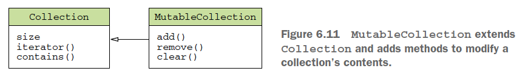
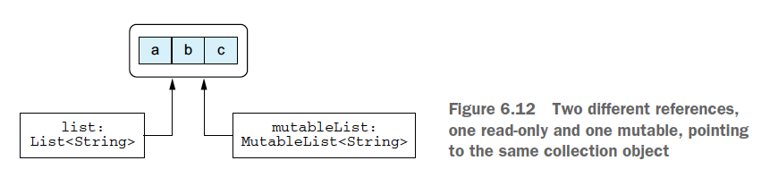

# Kotlin

var - mutable. Even though the `var` keyword allows a variable to change its value, its **type** is fixed.

val - immutable. But the object that it points to can be **mutable**.

```kotlin
val languages = arrayListOf("Java")
languages.add("Kotlin")
```

## Data Types

String/Char/Boolean/Int/Double/List/Set/Map

`==` Evaluates whether the `value` on the left is equal to the `value` on the right.

`===` Evaluates whether the two `instances` point to the `same reference`.

```kotlin
const val HERO_NAME = "Madrigal"  // compile-time constant
fun main() {
    val name = "Denis" // val - IMMUTABLE
    name = "Michael" // ERROR: val cannot be reassigned
    println("Hello, world!!! $name ${name.length}")

    /*
     var is used for variables which are mutable. Kotlin is a strongly typed language that
     The compiler will directly assume the size and type to a variable
     For example, if you assign any whole number to a variable,
     the compiler will directly assume that the variable is of type Int
    */
    var myAge = 31

    // Integer types: Byte (8 bit), Short (16 bit), Int (32 bit), Long (64 bit)
    val myByte: Byte = 127          // 2^7 - 1
    val myShort: Short = 32767      // 2^15 - 1
    val myInt: Int = 2_147_483_647  // 2^31 - 1
    val myLong: Long = 9_223_372_036_854_775_807    // 2^63 - 1

    // Floating Point number Types: Float (32 bit), Double (64 bit)
    val myFloat: Float = 13.37F
    val myDouble: Double = 3.14159265358979323846

    // Boolean
    var isSunny: Boolean = true

    // Char
    val letterChar = 'A'
    val digitChar = '1'

    // String
    val myStr = "Hello World"
    var firCharInStr = myStr[0]
    var lastCharInStr = myStr[myStr.length - 1]
}
```

## if/when/while/for

```kotlin
// Conditional Expression
val result: String = if (isA) "a" else "b"

// when
var season = 3
when(season) {
    1 -> println("Spring")
    2 -> println("Summer")
    3 -> {
        println("Fall")
        println("Autumn")
    }
    4 -> println("Winter")
    else -> println("invalid")
}

when(age) {
    !in 0..20  -> print("now you may drink in the US")
    in 18..20  -> print("now you may vote")
    16,17 -> print("you now may drive")
    else -> print("you're too young")
}

var x: Any = 13.37f
var x: Any = "string"
when(x) {
    is Int -> println("$x is an Int")
    !is Double -> println("$x is not Double")
    is String -> println("$x is a String")
    else -> println("$x is none of the above")
}
// $x is not Double
// $x is not Double

val x : Any = 13.37 // Double
val result =  when(x) {
    is Int -> "is an Int"
    !is Double -> "is not Double"
    is String -> "is a String"
    else -> "is none of the above"
}
print("$result") // 13.37 is none of the above

// Ranges
for(num in 1..10) {...} // 1 2 3 4 5 6 7 8 9 10
for(i in 1 until 10) { // Same as - for(i in 1.until(10))
    print("$i ")
}
// 1 2 3 4 5 6 7 8 9

for(i in 10 downTo 1) {  // Same as - for(i in 10.downTo(1))
    print("$i ")
}
for(i in 10 downTo 1 step 2) { // Same as - for(i in 10.downTo(1).step(2))
    print("$i ") // 10 8 6 4 2
}

// in to check collection and range membership
fun isLetter(c: Char) = c in 'a'..'z' || c in 'A'..'Z'
fun isNotDigit(c: Char) = c !in '0'..'9'
```

## function

```kotlin
// default argument
fun addUp(a: Int, b: Int = 0): Int {
    return a + b
}
addUp(a = 2, b = 3)

private fun quest(playerLevel: Int): String {
    return when (playerLevel) {
        1 -> "1"
        else -> "else"
    }
}
// single expression function
private fun quest(playerLevel: Int) = when (playerLevel) {
    1 -> "1"
    else -> "else"
}
```

`Unit` function - functions w/o return type, Kotlin automatically used the `Unit` as return type.

```kotlin
fun max(a: Int, b: Int): Int {
    return if (a > b) a else b
}
fun max(a: Int, b: Int): Int = if (a > b) a else b

fun <T> joinToString(
    collection: Collection<T>,
    separator: String = ", ",
    prefix: String = "",
    postfix: String = ""
): String {
    val result = StringBuilder(prefix)
    for ((index, element) in collection.withIndex()) {
        if (index > 0) result.append(separator)
        result.append(element)
    }
    result.append(postfix)
    return result.toString()
}
val list = listOf(1, 2, 3)
joinToString(list, ", ", "", "")  // 1, 2, 3
joinToString(list)  // 1, 2, 3
joinToString(list, "; ")  // 1; 2; 3
// named arguments, you can omit some arguments from the middle of the list
// and specify only the ones you need, in any order you want
joinToString(list, suffix = ";", prefix = "# ")  // # 1, 2, 3;
```

### Extension function

```kotlin
// declare an extension function on Collection<T>
fun <T> Collection<T>.joinToString(
    separator: String = ", ",
    prefix: String = "",
    postfix: String = "")
: String {
    val result = StringBuilder(prefix)
    // `this` refers to the receiver object: a collection of T
    for ((index, element) in this.withIndex())
        if (index > 0) result.append(separator)
        result.append(element)
    }
    result.append(postfix)
    return result.toString()
}
val list = listOf(1, 2, 3)
list.joinToString(separator = "; ", prefix = "(", postfix = ")") // (1; 2; 3)

val list = arrayListOf(1, 2, 3)
list.joinToString(" ")  // 1 2 3
```

## Nullable

`nullables` declare whether a variable can hold a `null` value or not.
The compiler can detect possible `NullPointerException` errors at _compile_ time

```kotlin
var name: String = "Denis"
name = null // Compilation Error!
val len = name.length
val lower = name.toLowerCase()

var nullableName: String? = "Denis"
nullableName = null // Works
val len2 = nullableName.length // Compilation Error
val lower2 = nullableName.toLowerCase()  // Compilation Error

// null check
if (nullableName != null) {
    println("Hello, ${nullableName.toLowerCase()}.")
} else {
    println("Hello, Guest")
}

// 'safe call' operator ?. combine a null-check and a method call in a single expression.
nullableName?.length
nullableName?.toLowerCase()

// This is the same as:
if (nullableName != null)
    nullableName.toLowerCase()
else
    null

// use methods on a nullable variable
val nullableName3: String? = null
println(nullableName3?.toLowerCase()) // null
println(nullableName3?.length) // null

// chain safe call
val wifesAge: String? = user?.wife?.age

// 'safe call' operator with 'let'
val nullableName4: String? = null
nullableName4?.let { println(it.toLowerCase()) }  // null
nullableName4?.let { println(it.length) }  // null

// use the elvis operator ?: to enter a default value
val name = nullableName4 ?: "Guest"
val wifesAge: Int = user?.wife?.age ?: 0

// The !! operator converts a nullable type to a non-null type,
// and throws a NullPointerException if the nullable type holds a null value.
// This is risky, only use it if 100% certain that there will be a value in the variable.
val nullableName5: String? = null
nullableName5!!.toLowerCase() // Results in NullPointerException
```

## Type and Casting

```kotlin
val stringList: List<String> = listOf("a", "b", "c")
val mixedTypeList: List<Any> = listOf("a", 31, b, "70.5")

for (value in mixedTypeList) {
    if (value is Int) {}
    else if (value is Double) {}
    else if (value is String) {}
    else {}

    // alternative
    when (value) {
        is Int -> println()
        is Double -> println()
        is String -> println()
        else -> println()
    }
}

// Casting
val obj1: Any = "string"
obj1 is String // true

// Explicit unsafe casting
val obj2: Any = 15
val str2: String = obj2 as String
str2.length    // ClassCastException

// Explicit safe casting
val obj3: Any = 1337
val str3: String? = obj3 as? String
str3 // null
```

## Collections

Read-only and mutable collections



Read-only collections can be mutable.


### Array

```kotlin
// type - IntArray/DoubleArray/BooleanArray...
val numbers: IntArray = intArrayOf(1, 2, 3, 4, 5)
val numbers = intArrayOf(1, 2, 3, 4, 5)
val numbers = arrayOf(1, 2, 3, 4, 5)

data class Fruit(val name: String, val price: Double)
val fruits = arrayOf(Fruit("Apple", 2.5), Fruit("Grape", 3.5))
print(fruits.contentToString())

for (index in fruits.indices) {
    println("${fruits[index].name} is in index $index")
}

val squares = IntArray(5) { i -> (i+1) * (i+1) } // 1, 4, 9, 16, 25
```

### List

```kotlin
val months = listOf("Jan", "Feb", "March")
println(months[1])
val additionalMonths = months.toMutableList()
additionalMonths.add("Apr")     // [Jan, Feb, March, Apr]

val days = mutableListOf<String>("Mon", "Tue", "Wed")
days.add("Thu")     // [Mon, Tue, Wed, Thu]
days[2] = "Sunday"  // [Mon, Tue, Sunday, Thu]
val removeList = mutableListOf<String>("Mon", "Wed")
days.removeAll(removeList)  // [Tue, Sunday, Thu]

val anyTypes = listOf(1, 2, 3, true, "string")

fun readNumbers(reader: BufferedReader): List<Int?> {
    val result = ArrayList<Int?>() // create a list of nullable Int values
    for (line in reader.lineSequence()) {
        try {
            val number = line.toInt()
            result.add(number)
        } catch(e: NumberFormatException) {
            result.add(null)
        }
    }
    return result
}
```

### Set/Map

```kotlin
val fruits = setOf("Orange", "Apple", "Apple", "Mango")
println(fruits.size)            // 3
println(fruits.toSortedSet())   // [Apple, Mango, Orange]

val newFruits = fruits.toMutableSet()
newFruits.add("Melon")
println(newFruits.toSortedSet())    // [Apple, Mango, Melon, Orange]

val daysWeek = mapOf(1 to "Monday", 2 to "Tuesday")
println(daysWeek[2])    // Tuesday
for (key in daysWeek.keys) {
    println("$key is to ${daysWeek[key]}")
}
val newDaysWeek = daysWeek.toMutableMap()
newDaysWeek[4] = "Thursday"
println(newDaysWeek.toSortedMap())  // {1=Monday, 2=Tuesday, 4=Thursday}
```

## Lambda function

```kotlin
// normal function
fun addNumber (a: Int, b: Int) {
    val answer = a + b
    print(answer)
}

// lambda
val sum: (Int, Int) -> Int = { a: Int, b: Int -> a + b }
// or
val sum = { a: Int, b: Int -> println(a + b) }
sum(10, 5)

val people = listOf(Person("Alice", 29), Person("Bob", 31))
people.maxBy { it.age }
people.maxBy({ p: Person -> p.age })  // lambda verbose

// using function parameters in a lambda
fun printProblemCounts(responses: Collection<String>) {
    var clientErrors = 0
    var serverErrors = 0
    responses.forEach {
        if (it.startsWith("4")) {
            clientErrors++
        } else if (it.startsWith("5")) {
            serverErrors++
        }
    }
    println("$clientErrors client errors, $serverErrors server errors")
}
val responses = listOf("200 OK", "418 I'm a teapot", "500 Internal Server Error")
printProblemCounts(responses) // 1 client errors, 1 server errors
```

```java
// passing lambda as parameter to a Java method
void postponeComputation(int delay, Runnable computation);
```

```kotlin
postponeComputation(1000) { println(42) }
// or pass an object expression as an implementation of a functional interface
postponeComputation(1000, object: Runnable {
    override fun run() {
        println(42)
    }
})
```

## Scope Functions

### `apply` function

`apply` can be thought of as a configuration function: It allows you to call a series of functions on a receiver
to configure it for use. After the lambda provided to `apply` executes, `apply` returns the configured receiver.

```kotlin
val guestList: List<String> = mutableListOf<String>().apply {
    if (isAfterMidnight) { add("Sidney") }
    if (isHappyHour) { add("Jamie") }
    if (contains("Janet") || contains("Jamie")) { add("Hal") }
}.toList()
```

### `let` function

`let` scopes a variable to the lambda provided and passes the receiver as an argument. This lets you refer to the receiver with the `it` identifier.

```kotlin
val patrons: List<String> = listOf(...)
val greeting = patrons.firstOrNull()?.let {
    "$it walks over to Madrigal and says, \"Hi! I'm $it. Welcome to Kronstadt!\""
} ?: "Nobody greets Madrigal because the tavern is empty"
```

`let` passes the receiver to the lambda you provide, but `apply` passes nothing.
Also, `apply` returns the current receiver when the lambda completes. `let`, on the other hand, returns the last line of the lambda.

### `run` function

`run` provides the same relative scoping behavior as `apply`, and it returns the result of the lambda expression,
instead of the receiver itself.

```kotlin
val tavernPlaylist = mutableListOf("Korobeiniki", "Kalinka", "Katyusha")
val nowPlayingMessage: String = tavernPlaylist.run {
    shuffle()
    "${first()} is currently playing in the tavern"
}
```

### `with` function

`with` is very similar to `run`. It behaves identically, but it uses a different calling convention. Unlike the scope functions you have seen so far, `with` requires its argument to be accepted as the first parameter rather than calling the scope function on a receiver type.

```kotlin
val isNameTooLong = with("a very looooooooooooooong name") {
    length >= 20
}

fun alphabet(): String {
    val stringBuilder = StringBuilder()
    return with(stringBuilder) {
        for (letter in 'A'..'Z') {
            this.append(letter)
        }
        append("Done")
        this.toString()
    }
}
// more refactoring
fun alphabet() = with(StringBuilder()) {
    for (letter in 'A'..'Z') {
        append(letter)
    }
    append("Done")
    toString()
}
```

### `also` function

The `also` function works very similarly to the `let` function. Just like `let`, `also` passes the receiver you call it on as an argument to the lambda you provide. But there is one major difference between `let` and `also`: `also` returns the receiver, rather than the result of the lambda.

```kotlin
var fileContents: List<String>
File("file.txt")
    .also { print(it.name) }
    .readLines()
    .also { fileContents = it }
```

### `takeif` function

`takeIf` works differently than the other scope functions: It evaluates a predicate condition provided in a lambda that returns either `true` or `false`. If the condition evaluates as `true`, the receiver is returned from `takeIf`.
If the condition is `false`, null is returned instead.

```kotlin
val fileContents = File("file.txt")
    .takeIf { it.exists() }
    ?.readText()
```

## Access Modifier

- `final` - cannot be overriden, default for class members
- `open` - can be overriden, should be specified explicitly
- `abstract` - MUST be overriden, can only be used in `abstract` classes, `abstract members` cannot have an implementation.
- `override` - overrides a member in a superclass or interface. Overriden member is `open` by default if not marked `final`

## Visibility Modifier

- `public`(default) - element is accessible from everywhere in the project
- `private` - element is accessible only _within the block_ in which properties, fields are declared
- `protected` - modifier with a class or an interface allows visibility to its class or subclass only
- `internal` - makes the field visible only inside the module in which it is implemented
- All classes are `final` by default, so they can't be inherited - use `open` key word

```kotlin
open class Base {
    var a = 1                   // public by default
    private var b = 2           // private to Base class
    protected open val c = 3    // visible to the Base and the Derived class
    internal val d = 4          // visible in the same module
    protected fun e() {}        // visible to the Base and the Derived class
}
class Derived: Base() {
    // a, c, d and e() of the Base class are visible
    override val c = 9          // here, c is still protected
}

fun main(args: Array<String>) {
    val base = Base()
    // base.a and base.d are visible
    // base.b, base.c and base.e() are not visible
    val derived = Derived()
    // only derived.a and derived.d are visible
}
```

## Nested class Inner class

`Nested class` - created inside another class. Is by default `static`

`Nested class` - **cannot** access the data members of outer classes

`Inner class` - created inside another class with keyword `inner`. It is able to access members of its outer class even it is private. `Inner class` keeps a reference to an object of its outer class.

```kotlin
// Nested class
class OuterClass {
    private var name: String = "x"
    class NestedClass {
        var description: String = "xx"
        private var id: Int = 101
        fun foo() {
            // CANNOT access the outer class member `name`
        }
    }
}

fun main(args: Array<String>) {
    OuterClass.NestedClass().description    // can access member property
    var obj = OuterClass.NestedClass()
    obj.foo()                               // can access member function
}

// Inner class
class OuterClass {
    private var name: String = "x"
    inner class InnerClass {
        var description: String = "xx"
        private var id: Int = 101
        fun foo() {
            // can access the `private` property name of the outer class
            println("name is ${name}")
        }
    }
}

fun main(args: Array<String>) {
    OuterClass().InnerClass().description    // can access member property
    var obj = OuterClass().InnerClass()
    obj.foo()                               // can access member function
}
```

## Cast

Unsafe cast `as`
Safe cast `as?`

```kotlin
val obj: Any? = "nullable string"
val str: String? = obj as String?  // works

val location: Any = "Kotlin"
val safeString: String? = location as? String  // Kotlin
val safeInt: Int? = location as? Int  // null
```

## try catch

#### Unchecked Exception

- exception that is thrown due to mistakes in our code
- `Unchecked Exception` extends the `RuntimeException` class, is checked at run time
- e.g. ArithmeticException, ArrayIndexOutOfBoundException, SecurityException, NulPointerException

#### Checked Exception

- `Checked Exception` extends the `Throwable` class
- checked at compile time
- e.g. IOException, SQLException

```kotlin
fun getNumber(str: String): Int {
    return try {
        Integer.parseInt(str)
    } catch (e: ArithmeticException) {
        0
    }
}
val str = getNumber("10.5")
println(str)    // 0

fun validate(age: Int) {
    if (age < 18) {
        throw ArithmeticException("under age")
    } else {
        print()
    }
}
validate(15)
println("code after validation check")
// Exception in thread "main: under age."
```

## dp sp

```kotlin
// LinearLayout
android:orientation="vertical"
android:layout_weight="1"
android:onClick="onPress"
(view as Button).text
android:padding="10dp"
android:gravity="right|bottom|center_vertical"

android:screenOrientation="portrait"
android:theme="@style/NoActionBarTheme"
// resize when soft keyboard displays
android:windowSoftInputMode="adjustResize"
```

## Room Database

### 3 components of Room Database

- Entity
- DAO
- Database

## object Keyword

The `object` keyword defines a class and creates an instance of that class at the same time.

1. object declaration - combine `class` declaration and a declaration of `a single instance` of that class

```kotlin
object Payroll {
    val allEmployees = arrayListOf<Person>()
    fun calculateSalary() {
        for (person in allEmployees) {
            ...
        }
    }
}
Payroll.allEmployees.add(Person(...))
Payroll.calculateSalary()
```

`object declaration` can also inherit from `classes` and `interfaces`

```kotlin
// inherit from interface
object CaseInsensitiveFileComparator: Comparator<File> {
    override fun compare(file1: File, file2: File): Int {
        return file1.path.compareTo(file2.path, ignoreCase = True)
    }
}
println(CaseInsensitiveFileComparator.compare(File("/User"), File("/user"))) // 0

val files = listOf(File("/Z"), File("/a"))
println(files.sortedWith(CaseInsensitiveFileComparator)) // [/a, /Z]
```

Nested object

```kotlin
data class Person(val name: String) {
    object NameComparator : Comparator<Person> {
        override fun compare(p1: Person, p2: Person): Int = p1.name.compareTo(p2.name)
    }
}
val persons = listOf(Person("Bob"), Person("Alice"))
println(persons.sortedWith(Person.NameComparator)) // [Person(name=Alice), Person(name=Bob)]
```

2. Companion object - `static` property/function in Kotlin

```kotlin
class A {
    companion object {
        fun bar() {...}
    }
}
A.bar()

class User private constructor(val nickname: String) {  // private primary constructor
    companion object {
        fun newSubscribingUser(email: String) = User(email.substringBefore("@"))
        fun newFacebookUser(accountId: Int) = User(getFacebookName(accountId))
    }
}
val subscribingUser = User.newSubscribingUser("bob@gmail.com")
val facebookUser = User.newFacebookUser(4)
```
